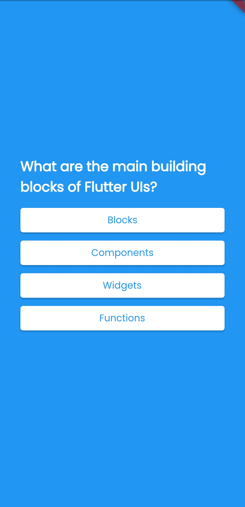
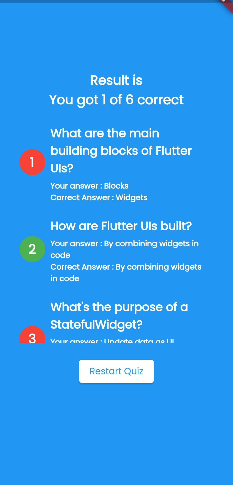

# Quiz App in Flutter

### This is my starting project to learn flutter

### Things I have learned in this project
- Using stateful widgets to update UI based on data
- Using stateless widgets to display data simply
- Render Images and using custom assets
- Conditional Rendering in the flutter
- Importing open-source packages from pub.dev
- Styling the components
- Different widgets, including Scrollable widgets, Buttons, Texts, Rows, Columns, Expanded widgets

### ScreenShots:
Quiz Screen                 |  Questions Screen         |  Result Screen            |
:--------------------------:|:-------------------------:|:-------------------------:|
 |  | 
#### By the way, I am a React developer, and I can easily connect the core concepts with Flutter
